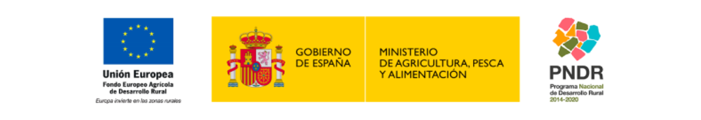

En base a dicha convocatoria surge el grupo operativo «AOVE-Tradicional”, el cual recibe una subvención de 479.882,50€ cofinanciada al 100% por el Fondo Europeo Agrícola de Desarrollo Rural (FEADER).

Autoridad encargada de la gestión de la aplicación de la ayuda FEADER y nacional DGDRIFA. Organismo responsable del contenido: GO AOVE Tradicional. Certificación blockchain de trazabilidad del aceite de oliva virgen extra del olivar tradicional.

[Rural development](https://commission.europa.eu/eu-regional-and-urban-development/topics/rural-development_es)

